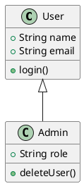
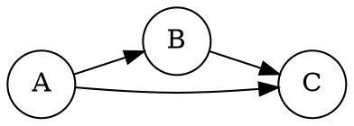

# ComfyUI Kroki Wrapper

A ComfyUI custom node for rendering diagrams using the [Kroki API](https://kroki.io). Create beautiful diagrams from text descriptions directly in your ComfyUI workflows.

## Features

- **22+ Diagram Types**: Mermaid, PlantUML, GraphViz, D2, Excalidraw, and many more
- **High-Quality Scaling**: Uses ImageMagick to convert vector SVG to any resolution without quality loss
- **Customizable Output**: Control width, height, and background color
- **Self-Hosting Support**: Use the public Kroki service or point to your own instance
- **ComfyUI Native**: Outputs standard image tensors compatible with all ComfyUI nodes

## Installation

1. Clone or download this repository into your ComfyUI `custom_nodes` folder:
   ```bash
   cd ComfyUI/custom_nodes
   git clone https://github.com/yourusername/comfyui-kroki-wrapper.git
   ```

2. Restart ComfyUI

The node will appear under **image/generation → Render Diagram (Kroki)**

## Requirements

This node requires **Playwright** (headless browser) for high-quality SVG to PNG conversion with full foreignObject support.

### Installing Playwright

Playwright will be auto-installed when you first load the node in ComfyUI. However, you can also install it manually:

```bash
pip install playwright
playwright install chromium
```

**Note:** The Chromium browser binary download is approximately 300MB. This is a one-time download.

### Why Playwright?

Many modern diagram types (especially Mermaid) use SVG `foreignObject` elements that contain HTML/CSS. These require a full browser rendering engine to display correctly. Playwright provides this capability with excellent reliability across all diagram types.

### Python Dependencies

- `playwright` (auto-installed by the node)
- `requests` (usually already included with ComfyUI)
- `Pillow` (usually already included with ComfyUI)

## Usage

### Basic Example - Mermaid Diagram

1. Add the "Render Diagram (Kroki)" node to your workflow
2. Set **diagram_type** to `mermaid`
3. Enter your Mermaid code in **diagram_code**:
   ```
   graph TD
       A[Start] --> B{Decision}
       B -->|Yes| C[Action 1]
       B -->|No| D[Action 2]
       C --> E[End]
       D --> E
   ```
4. Adjust width/height as needed
5. Connect the output to other ComfyUI image nodes

### Supported Diagram Types

- **mermaid** - Flowcharts, sequence diagrams, Gantt charts
- **plantuml** - UML diagrams, wireframes
- **graphviz** - DOT language graphs
- **d2** - Modern declarative diagramming language
- **excalidraw** - Hand-drawn style diagrams
- **blockdiag** - Simple block diagrams
- **seqdiag** - Sequence diagrams
- **dbml** - Database diagrams
- **erd** - Entity relationship diagrams
- **nomnoml** - UML diagrams
- **wavedrom** - Digital timing diagrams
- And many more!

See [Kroki documentation](https://kroki.io/#support) for full list and syntax examples.

### Parameters

| Parameter | Description | Default |
|-----------|-------------|---------|
| **diagram_code** | Your diagram code (syntax depends on diagram type) | Mermaid example |
| **diagram_type** | Type of diagram to render | `mermaid` |
| **width** | Output image width in pixels | 1024 |
| **height** | Output image height in pixels | 768 |
| **background_color** | Background color (transparent/white/black/custom) | `white` |
| **custom_bg_color** | Custom hex color (when background_color = custom) | `#ffffff` |
| **kroki_url** | Kroki service URL (for self-hosting) | `https://kroki.io` |

### Example Workflows

**PlantUML Class Diagram:**


**GraphViz Network Diagram:**


## Self-Hosting

For offline use or privacy, you can run your own Kroki instance:

```bash
docker run -d -p 8000:8000 yuzutech/kroki
```

Then set **kroki_url** to `http://localhost:8000` in the node.

## How It Works

1. Your diagram code is compressed (deflate) and base64-encoded
2. Sent to Kroki API via HTTP GET request
3. Kroki renders the diagram as vector SVG
4. Playwright (headless Chromium) renders the SVG in a browser context at your specified resolution
5. Screenshot is captured as PNG with perfect quality and full HTML/CSS support
6. Result is converted to ComfyUI image tensor for use in your workflow

This approach ensures diagrams remain sharp and crisp at any resolution, with full support for modern diagram features like foreignObject elements!

## Privacy & Internet Connection

- **Public service**: Sends your diagram code to https://kroki.io (requires internet)
- **Self-hosted**: No data leaves your machine (works offline)

The Kroki project is open-source and [privacy-respecting](https://kroki.io/#privacy).

## Troubleshooting

**"Failed to render SVG using Playwright"**
- Make sure Playwright and Chromium are installed: `pip install playwright && playwright install chromium`
- Check that you have enough disk space (~300MB for Chromium)
- On some systems, you may need to install additional dependencies for Chromium to run

**"Failed to render diagram via Kroki"**
- Check your internet connection
- Verify the diagram code syntax is correct for the selected diagram type
- Try the example code for that diagram type from [Kroki docs](https://kroki.io)

**Node doesn't appear in ComfyUI**
- Ensure the file is named `__init__.py` in the `custom_nodes/comfyui-kroki-wrapper/` folder
- Restart ComfyUI completely
- Check the console for any Python errors

**Slow first run**
- The first time you use the node, it will download and install Playwright and Chromium (~300MB)
- Subsequent runs will be much faster

## Credits

- [Kroki](https://kroki.io) - Universal diagram rendering service
- [Mermaid](https://mermaid.js.org) - Diagram syntax
- [PlantUML](https://plantuml.com) - UML diagrams
- And all the other amazing diagram tools Kroki supports!

## License

MIT License

Copyright (c) 2026

Permission is hereby granted, free of charge, to any person obtaining a copy
of this software and associated documentation files (the "Software"), to deal
in the Software without restriction, including without limitation the rights
to use, copy, modify, merge, publish, distribute, sublicense, and/or sell
copies of the Software, and to permit persons to whom the Software is
furnished to do so, subject to the following conditions:

The above copyright notice and this permission notice shall be included in all
copies or substantial portions of the Software.

THE SOFTWARE IS PROVIDED "AS IS", WITHOUT WARRANTY OF ANY KIND, EXPRESS OR
IMPLIED, INCLUDING BUT NOT LIMITED TO THE WARRANTIES OF MERCHANTABILITY,
FITNESS FOR A PARTICULAR PURPOSE AND NONINFRINGEMENT. IN NO EVENT SHALL THE
AUTHORS OR COPYRIGHT HOLDERS BE LIABLE FOR ANY CLAIM, DAMAGES OR OTHER
LIABILITY, WHETHER IN AN ACTION OF CONTRACT, TORT OR OTHERWISE, ARISING FROM,
OUT OF OR IN CONNECTION WITH THE SOFTWARE OR THE USE OR OTHER DEALINGS IN THE
SOFTWARE.

## Contributing

Issues and pull requests welcome!
