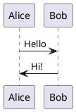
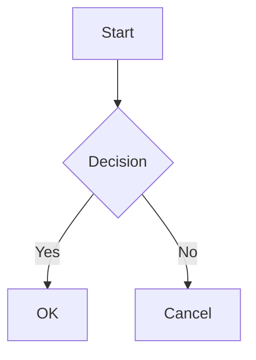
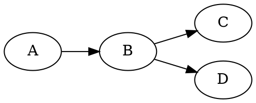

# Kroki.io Diagram Types Reference Guide

This guide provides examples of all diagram formats supported by Kroki.io.

## Table of Contents

1. [PlantUML](#plantuml)
2. [Mermaid](#mermaid)
3. [GraphViz](#graphviz)
4. [BlockDiag Family](#blockdiag-family)
5. [Ditaa](#ditaa)
6. [ERD](#erd)
7. [Nomnoml](#nomnoml)
8. [SvgBob](#svgbob)
9. [Vega / Vega-Lite](#vega--vega-lite)
10. [WaveDrom](#wavedrom)
11. [BPMN](#bpmn)
12. [Excalidraw](#excalidraw)
13. [Pikchr](#pikchr)
14. [D2](#d2)
15. [DBML](#dbml)
16. [Structurizr](#structurizr)
17. [C4-PlantUML](#c4-plantuml)
18. [Bytefield](#bytefield)
19. [WireViz](#wireviz)
20. [Symbolator](#symbolator)
21. [TikZ](#tikz)

---

## PlantUML

**Type:** `plantuml`  
**Best for:** UML diagrams, sequence diagrams, class diagrams, use cases

**Example:**


**API URL:** `https://kroki.io/plantuml/svg/{encoded_diagram}`

---

## Mermaid

**Type:** `mermaid`  
**Best for:** Flowcharts, sequence diagrams, Gantt charts, pie charts, state diagrams

**Example:**


**API URL:** `https://kroki.io/mermaid/svg/{encoded_diagram}`

---

## GraphViz

**Type:** `graphviz`  
**Best for:** Directed graphs, network diagrams, hierarchical structures

**Example:**


**API URL:** `https://kroki.io/graphviz/svg/{encoded_diagram}`

---

## BlockDiag Family

The BlockDiag family includes several specialized diagram types:

### BlockDiag
**Type:** `blockdiag`  
**Best for:** Block diagrams, simple flowcharts

```blockdiag
blockdiag {
    A -> B -> C;
    B -> D;
}
```

### SeqDiag
**Type:** `seqdiag`  
**Best for:** Sequence diagrams, message flows

```seqdiag
seqdiag {
    browser -> webserver [label = "GET /"];
    webserver -> database [label = "SELECT"];
    database --> webserver;
    webserver --> browser;
}
```

### ActDiag
**Type:** `actdiag`  
**Best for:** Activity diagrams with swim lanes

```actdiag
actdiag {
    write -> convert -> image;
    lane user {
        label = "User"
        write [label = "Write"];
        image [label = "Get image"];
    }
    lane Kroki {
        convert [label = "Convert"];
    }
}
```

### NwDiag
**Type:** `nwdiag`  
**Best for:** Network diagrams

```nwdiag
nwdiag {
    network dmz {
        web01;
        web02;
    }
    network internal {
        web01;
        db01;
    }
}
```

### PacketDiag
**Type:** `packetdiag`  
**Best for:** Packet header diagrams

```packetdiag
packetdiag {
    0-7: Source Port
    8-15: Destination Port
    16-31: Sequence Number
}
```

### RackDiag
**Type:** `rackdiag`  
**Best for:** Server rack layouts

```rackdiag
rackdiag {
    16U;
    1: UPS [2U];
    3: DB Server;
    4: Web Server;
}
```

---

## Ditaa

**Type:** `ditaa`  
**Best for:** ASCII art to diagram conversion

**Example:**
```ditaa
+---------+
| Hello   |
| World!  |
+---------+
```

**API URL:** `https://kroki.io/ditaa/svg/{encoded_diagram}`

---

## ERD

**Type:** `erd`  
**Best for:** Entity-relationship diagrams for databases

**Example:**
```erd
[Person]
*name
height
weight

[Company]
*name
+employees

Person *--1 Company
```

**API URL:** `https://kroki.io/erd/svg/{encoded_diagram}`

---

## Nomnoml

**Type:** `nomnoml`  
**Best for:** UML diagrams with a hand-drawn style

**Example:**
```nomnoml
[Pirate|eyeCount: Int|raid();pillage()|
  [beard]--[parrot]
  [beard]-:>[foul mouth]
]

[<abstract>Marauder]<:--[Pirate]
```

**API URL:** `https://kroki.io/nomnoml/svg/{encoded_diagram}`

---

## SvgBob

**Type:** `svgbob`  
**Best for:** Converting ASCII diagrams to SVG

**Example:**
```svgbob
       .---.
      /-o-/--
   .-/ / /->
  ( *  \/
   '-.  \
      \ /
       '
```

**API URL:** `https://kroki.io/svgbob/svg/{encoded_diagram}`

---

## Vega / Vega-Lite

**Type:** `vega` or `vegalite`  
**Best for:** Data visualizations, charts, graphs

**Vega Example:**
```json
{
  "$schema": "https://vega.github.io/schema/vega/v5.json",
  "width": 200,
  "height": 200,
  "data": [{
    "name": "table",
    "values": [
      {"x": 1, "y": 28},
      {"x": 2, "y": 55}
    ]
  }],
  "marks": [{
    "type": "line",
    "from": {"data": "table"}
  }]
}
```

**API URL:** `https://kroki.io/vega/svg/{encoded_diagram}`

---

## WaveDrom

**Type:** `wavedrom`  
**Best for:** Digital timing diagrams

**Example:**
```json
{
  "signal": [
    {"name": "clk", "wave": "p.....|..."},
    {"name": "dat", "wave": "x.345x|=.x"},
    {"name": "req", "wave": "0.1..0|1.0"}
  ]
}
```

**API URL:** `https://kroki.io/wavedrom/svg/{encoded_diagram}`

---

## BPMN

**Type:** `bpmn`  
**Best for:** Business Process Model and Notation diagrams

**Example:**
```xml
<?xml version="1.0" encoding="UTF-8"?>
<definitions xmlns="http://www.omg.org/spec/BPMN/20100524/MODEL">
  <process id="Process_1" isExecutable="false">
    <startEvent id="StartEvent_1"/>
  </process>
</definitions>
```

**API URL:** `https://kroki.io/bpmn/svg/{encoded_diagram}`

---

## Excalidraw

**Type:** `excalidraw`  
**Best for:** Hand-drawn style diagrams

**Example:**
```json
{
  "type": "excalidraw",
  "version": 2,
  "elements": [{
    "type": "rectangle",
    "x": 100,
    "y": 100,
    "width": 186,
    "height": 141
  }]
}
```

**API URL:** `https://kroki.io/excalidraw/svg/{encoded_diagram}`

---

## Pikchr

**Type:** `pikchr`  
**Best for:** Simple diagram scripting language

**Example:**
```pikchr
box "Hello" "World!"
```

**API URL:** `https://kroki.io/pikchr/svg/{encoded_diagram}`

---

## D2

**Type:** `d2`  
**Best for:** Modern declarative diagram scripting

**Example:**
```d2
x -> y: hello
y -> z: world
```

**API URL:** `https://kroki.io/d2/svg/{encoded_diagram}`

---

## DBML

**Type:** `dbml`  
**Best for:** Database schema diagrams

**Example:**
```dbml
Table users {
  id integer [primary key]
  username varchar
  created_at timestamp
}

Table posts {
  id integer [primary key]
  user_id integer
}

Ref: posts.user_id > users.id
```

**API URL:** `https://kroki.io/dbml/svg/{encoded_diagram}`

---

## Structurizr

**Type:** `structurizr`  
**Best for:** C4 model architecture diagrams

**Example:**
```
workspace {
    model {
        user = person "User"
        system = softwareSystem "System" {
            webapp = container "Web App"
        }
        user -> webapp "Uses"
    }
    views {
        systemContext system {
            include *
            autolayout lr
        }
    }
}
```

**API URL:** `https://kroki.io/structurizr/svg/{encoded_diagram}`

---

## C4-PlantUML

**Type:** `c4plantuml`  
**Best for:** C4 architecture diagrams using PlantUML

**Example:**
```plantuml
@startuml
!include C4_Context.puml

Person(customer, "Customer")
System(system, "System")

Rel(customer, system, "Uses")
@enduml
```

**API URL:** `https://kroki.io/c4plantuml/svg/{encoded_diagram}`

---

## Bytefield

**Type:** `bytefield`  
**Best for:** Byte/bit field diagrams for protocols

**Example:**
```clojure
(def boxes-per-row 8)
(draw-column-headers)
(draw-box "Destination" {:span 6})
(draw-box "Src" {:span 2})
```

**API URL:** `https://kroki.io/bytefield/svg/{encoded_diagram}`

---

## WireViz

**Type:** `wireviz`  
**Best for:** Cable and wiring diagrams

**Example:**
```yaml
connectors:
  X1:
    type: Molex 22-27-2021
    pinlabels: [GND, VCC]
  X2:
    pinlabels: [GND, VCC, SCL, SDA]

cables:
  W1:
    gauge: 24 AWG
    wirecount: 4

connections:
  - [X1: [1,2], W1: [1,2], X2: [1,2]]
```

**API URL:** `https://kroki.io/wireviz/svg/{encoded_diagram}`

---

## Symbolator

**Type:** `symbolator`  
**Best for:** HDL (VHDL/Verilog) component diagrams

**Example:**
```vhdl
library IEEE;
use IEEE.std_logic_1164.all;

entity half_adder is
  port (
    a, b : in std_logic;
    sum, carry : out std_logic
  );
end entity;
```

**API URL:** `https://kroki.io/symbolator/svg/{encoded_diagram}`

---

## TikZ

**Type:** `tikz`  
**Best for:** LaTeX-based diagrams

**Example:**
```latex
\begin{tikzpicture}
  \node[circle,draw] (A) at (0,0) {A};
  \node[circle,draw] (B) at (2,0) {B};
  \draw[->] (A) -- (B);
\end{tikzpicture}
```

**API URL:** `https://kroki.io/tikz/svg/{encoded_diagram}`

---

## Using Kroki API

### GET Request (with encoded diagram)
1. Encode your diagram using deflate + base64
2. Make request: `GET https://kroki.io/{diagram_type}/{output_format}/{encoded}`

### POST Request (with plain text)
```bash
curl -X POST https://kroki.io/{diagram_type}/{output_format} \
  -H "Content-Type: text/plain" \
  -d "your diagram code"
```

### Supported Output Formats
- `svg` - Scalable Vector Graphics (supported by all types)
- `png` - Portable Network Graphics
- `pdf` - Portable Document Format
- `jpeg` - JPEG image
- `txt` - Plain text (some types only)

## Resources

- **Official Website:** https://kroki.io
- **Documentation:** https://docs.kroki.io
- **GitHub:** https://github.com/yuzutech/kroki
- **Examples:** https://docs.kroki.io/kroki/diagram-types/

---

*Total Diagram Types: 27*  
*Generated on: February 14, 2026*
